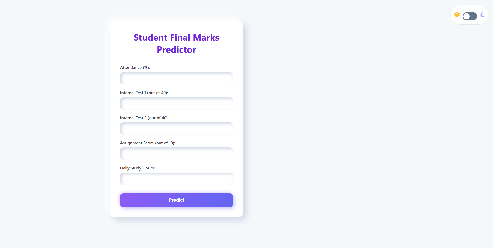
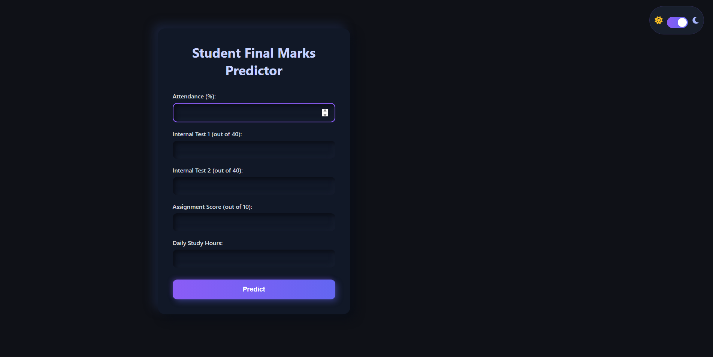
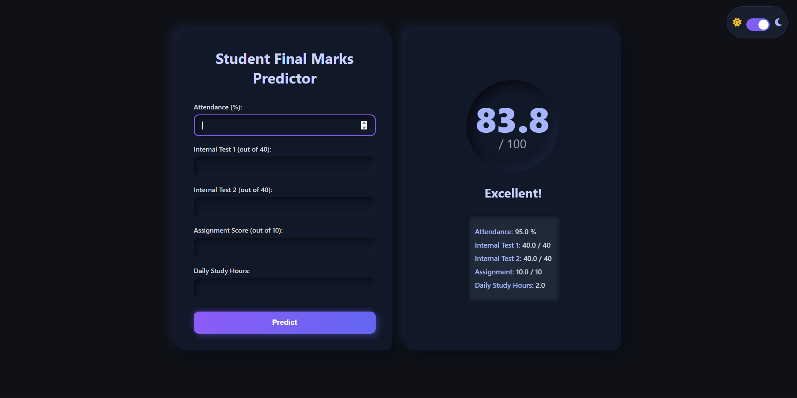
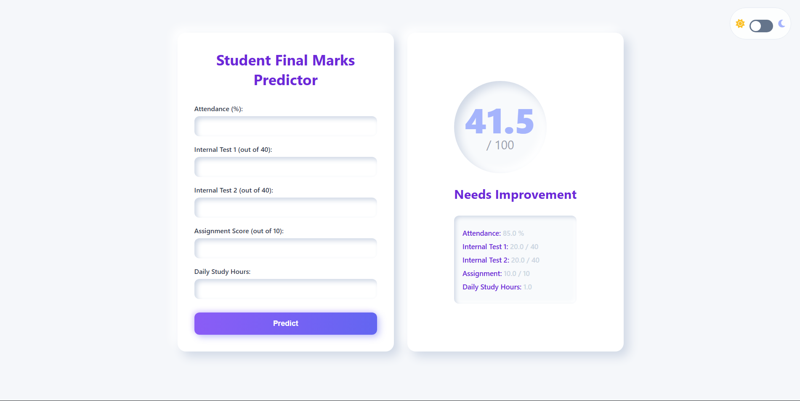

# 🎓 Student Final Score Predictor

A Machine Learning–based web application that predicts a student’s **final exam score** using academic performance and study behavior data.  
The project uses **Linear Regression** and is deployed as a **Flask web application**.

---

## 📌 Project Overview

Predicting student performance helps educators identify learning gaps early and provide proper academic guidance.  
This project predicts **final exam score (out of 100)** based on:

- Attendance percentage  
- Internal Test 1 score  
- Internal Test 2 score  
- Assignment score  
- Daily study hours  

The trained **Linear Regression model** is integrated into a **professional web interface** where users can input values and instantly get predictions.

---

## 🧠 Machine Learning Details

- **Problem Type**: Supervised Regression  
- **Model Used**: Linear Regression  
- **Why Linear Regression was chosen**:
  - Simple and interpretable  
  - Works well for structured academic data  
  - Easy to justify and explain in viva  

---

## 📊 Input Features

| Feature | Description |
|------|------------|
| Attendance (%) | Student attendance percentage |
| Internal Test 1 | Score out of 40 |
| Internal Test 2 | Score out of 40 |
| Assignment Score | Score out of 10 |
| Daily Study Hours | Average hours studied per day |

---

## 🎯 Output

- **Predicted Final Exam Score (out of 100)**
- Performance category:
  - 🌟 Excellent  
  - 👍 Good  
  - ⚠️ Needs Improvement  

---

## 🛠️ Tech Stack Used

### Machine Learning
- Python  
- Pandas  
- NumPy  
- Scikit-learn  

### Web Development
- Flask (Backend)  
- HTML & CSS (Frontend)  

### Tools
- Google Colab (Model training)  
- VS Code (Development)  
- GitHub (Version control)  

---

## 📁 Project Structure
student-final-score-predictor-website/
│
├── app.py
├── linear_regression_model.pkl
├── requirements.txt
├── README.md
├── .gitignore
│
├── templates/
│ └── index.html
│
├── static/
│ └── style.css
│
└── images/
├── home_page_L.png
├── home_page_D.png
├── excellent_result.png
└── improvement_result.png

---

## 🖼️ Application Screenshots

### 🔹 Home Page – Input Form
This page allows users to enter academic and study-related details.

---

### 🔹 Prediction Result – Excellent Performance
This screen shows the prediction output when the model predicts a high final score
with an **Excellent** performance message.

---

### 🔹 Prediction Result – Needs Improvement
This screen shows the prediction output when the model predicts a lower final score
with a **Needs Improvement** message.

👨‍💻 Author

Ajal Krishna
B.Tech Computer Science

Machine Learning Project

